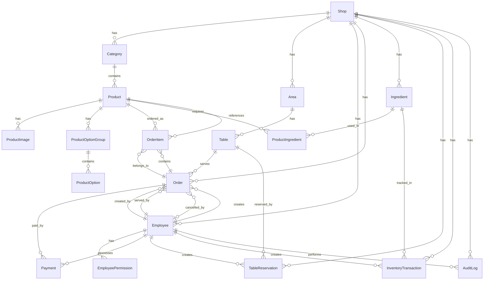

# ERD - Coffee Shop Management

**Document Version:** 1.0  
**Last Updated:** 2025-12-10  
**Author:** Database Engineer Team  
**Status:** Completed

---

## 📊 Entity Relationship Diagram

### Mermaid Diagram

---

## 📋 Entity Relationships Summary

### One-to-Many (1:N) Relationships

1. **Shop → Category** (1:N)
   - Một quán có nhiều danh mục
   - Foreign Key: `category.shop_id → shop.id`

2. **Shop → Product** (1:N, through Category)
   - Một quán có nhiều sản phẩm (qua danh mục)
   - Foreign Key: `product.shop_id → shop.id`, `product.category_id → category.id`

3. **Shop → Area** (1:N)
   - Một quán có nhiều khu vực
   - Foreign Key: `area.shop_id → shop.id`

4. **Area → Table** (1:N)
   - Một khu vực có nhiều bàn
   - Foreign Key: `table.area_id → area.id`

5. **Shop → Employee** (1:N)
   - Một quán có nhiều nhân viên
   - Foreign Key: `employee.shop_id → shop.id`

6. **Shop → Order** (1:N)
   - Một quán có nhiều đơn hàng
   - Foreign Key: `order.shop_id → shop.id`

7. **Table → Order** (1:N)
   - Một bàn có nhiều đơn hàng (theo thời gian)
   - Foreign Key: `order.table_id → table.id`

8. **Order → OrderItem** (1:N)
   - Một đơn hàng có nhiều chi tiết
   - Foreign Key: `order_item.order_id → order.id` (ON DELETE CASCADE)

9. **Product → OrderItem** (1:N)
   - Một sản phẩm có thể có trong nhiều đơn hàng
   - Foreign Key: `order_item.product_id → product.id`

10. **Order → Payment** (1:N)
    - Một đơn hàng có thể có nhiều thanh toán (thanh toán một phần)
    - Foreign Key: `payment.order_id → order.id`

11. **Product → ProductImage** (1:N)
    - Một sản phẩm có nhiều ảnh
    - Foreign Key: `product_image.product_id → product.id` (ON DELETE CASCADE)

12. **Product → ProductOptionGroup** (1:N)
    - Một sản phẩm có nhiều nhóm tùy chọn
    - Foreign Key: `product_option_group.product_id → product.id` (ON DELETE CASCADE)

13. **ProductOptionGroup → ProductOption** (1:N)
    - Một nhóm tùy chọn có nhiều tùy chọn
    - Foreign Key: `product_option.option_group_id → product_option_group.id` (ON DELETE CASCADE)

14. **Employee → EmployeePermission** (1:N)
    - Một nhân viên có nhiều quyền
    - Foreign Key: `employee_permission.employee_id → employee.id` (ON DELETE CASCADE)

15. **Shop → Ingredient** (1:N)
    - Một quán có nhiều nguyên liệu
    - Foreign Key: `ingredient.shop_id → shop.id`

16. **Product → ProductIngredient** (1:N)
    - Một sản phẩm có nhiều nguyên liệu (công thức)
    - Foreign Key: `product_ingredient.product_id → product.id` (ON DELETE CASCADE)

17. **Ingredient → ProductIngredient** (1:N)
    - Một nguyên liệu có thể dùng cho nhiều sản phẩm
    - Foreign Key: `product_ingredient.ingredient_id → ingredient.id`

18. **Ingredient → InventoryTransaction** (1:N)
    - Một nguyên liệu có nhiều giao dịch kho
    - Foreign Key: `inventory_transaction.ingredient_id → ingredient.id`

19. **Shop → InventoryTransaction** (1:N)
    - Một quán có nhiều giao dịch kho
    - Foreign Key: `inventory_transaction.shop_id → shop.id`

20. **Shop → TableReservation** (1:N)
    - Một quán có nhiều đặt bàn
    - Foreign Key: `table_reservation.shop_id → shop.id`

21. **Table → TableReservation** (1:N)
    - Một bàn có nhiều đặt bàn (theo thời gian)
    - Foreign Key: `table_reservation.table_id → table.id`

22. **Shop → AuditLog** (1:N)
    - Một quán có nhiều log
    - Foreign Key: `audit_log.shop_id → shop.id`

23. **Employee → AuditLog** (1:N)
    - Một nhân viên có nhiều log
    - Foreign Key: `audit_log.user_id → employee.id`

### Many-to-Many (N:M) Relationships

1. **Product ↔ Ingredient** (N:M, through ProductIngredient)
   - Một sản phẩm cần nhiều nguyên liệu
   - Một nguyên liệu có thể dùng cho nhiều sản phẩm
   - Junction Table: `product_ingredient`
   - Foreign Keys: `product_ingredient.product_id → product.id`, `product_ingredient.ingredient_id → ingredient.id`
   - Unique Constraint: `(product_id, ingredient_id)`

---

## 🔑 Primary Keys

Tất cả các tables sử dụng **UUID** làm primary key:
- Format: `UUID` (PostgreSQL `gen_random_uuid()`)
- Type: `UUID` (PostgreSQL native type)

---

## 🔗 Foreign Keys

Tất cả foreign keys đều có:
- **Referential Integrity**: ON DELETE và ON UPDATE rules
- **Indexes**: Tự động tạo index cho foreign keys
- **Naming Convention**: `fk_{table}_{column}`

### ON DELETE Rules:

- **CASCADE**: 
  - `product_image.product_id` → Xóa sản phẩm thì xóa ảnh
  - `product_option_group.product_id` → Xóa sản phẩm thì xóa nhóm tùy chọn
  - `product_option.option_group_id` → Xóa nhóm thì xóa tùy chọn
  - `order_item.order_id` → Xóa đơn hàng thì xóa chi tiết
  - `employee_permission.employee_id` → Xóa nhân viên thì xóa quyền
  - `product_ingredient.product_id` → Xóa sản phẩm thì xóa công thức

- **RESTRICT** (default):
  - Tất cả các foreign keys khác → Không cho phép xóa nếu còn reference

---

## 📊 Cardinality Summary

| Relationship | Type | Cardinality |
|--------------|------|-------------|
| Shop → Category | 1:N | 1 to many |
| Category → Product | 1:N | 1 to many |
| Shop → Area | 1:N | 1 to many |
| Area → Table | 1:N | 1 to many |
| Shop → Employee | 1:N | 1 to many |
| Shop → Order | 1:N | 1 to many |
| Table → Order | 1:N | 1 to many |
| Order → OrderItem | 1:N | 1 to many |
| Product → OrderItem | 1:N | 1 to many |
| Order → Payment | 1:N | 1 to many |
| Product → ProductImage | 1:N | 1 to many |
| Product → ProductOptionGroup | 1:N | 1 to many |
| ProductOptionGroup → ProductOption | 1:N | 1 to many |
| Employee → EmployeePermission | 1:N | 1 to many |
| Shop → Ingredient | 1:N | 1 to many |
| Product ↔ Ingredient | N:M | Many to many |
| Ingredient → InventoryTransaction | 1:N | 1 to many |
| Shop → TableReservation | 1:N | 1 to many |
| Table → TableReservation | 1:N | 1 to many |
| Shop → AuditLog | 1:N | 1 to many |
| Employee → AuditLog | 1:N | 1 to many |

---

## 🎯 Design Principles

1. **Normalization**: 3NF (Third Normal Form) trở lên
2. **ACID Compliance**: Tất cả transactions đảm bảo ACID
3. **Referential Integrity**: Foreign keys với proper constraints
4. **Soft Delete**: Sử dụng `deleted_at` cho các entities quan trọng
5. **Audit Trail**: `created_at`, `updated_at`, `created_by`, `updated_by`
6. **Indexing**: Indexes cho foreign keys và columns thường query
7. **Naming Convention**: `snake_case` cho tables và columns

---

**Document Version:** 1.0  
**Last Updated:** 2025-12-10  
**Next Review:** 2025-12-17

